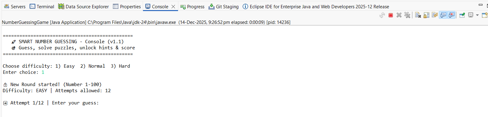

# CodSoft Internship Projects

## Task 1: Number Guessing Game
- Console based game
- User guesses number until correct
- ## Task 1: Number Guessing Game

## Task 2: Student Grade Calculator
- Takes marks input
- Calculates grade and percentage
- Calculates average marks and assigns grade.
- Implemented inside StudentManagementSystem project.

## Task 3: ATM Interface
- Swing GUI
- Deposit, Withdraw, Balance
- Privacy features: PIN authentication + masked account number

## Task 4: Currency Converter
- Converts between USD, EUR, INR, GBP, JPY
- Features: Swap button, error handling, auto-clear input, console + UI output
- Run: Right-click `CurrencyConverter.java` → Run As → Java Application
